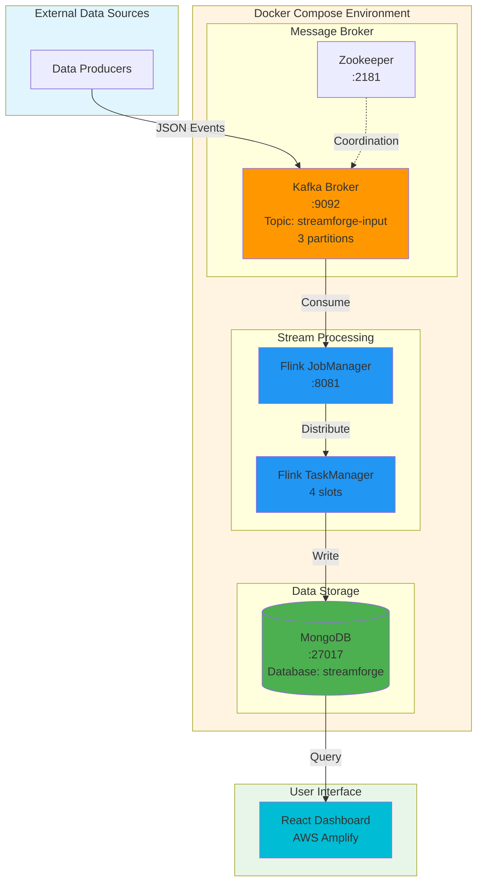
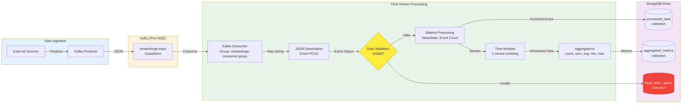
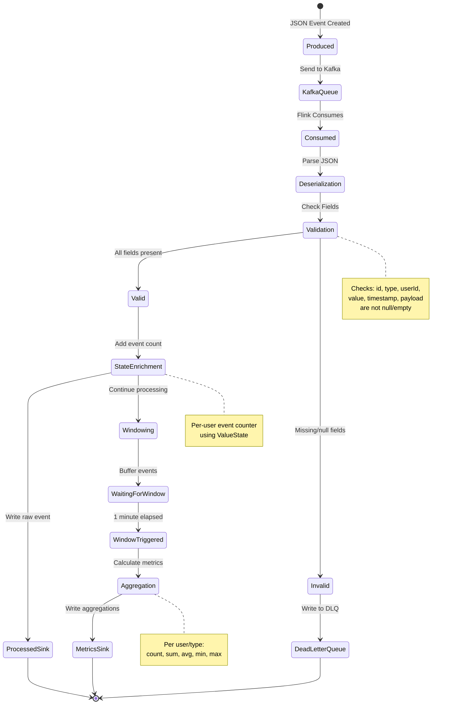
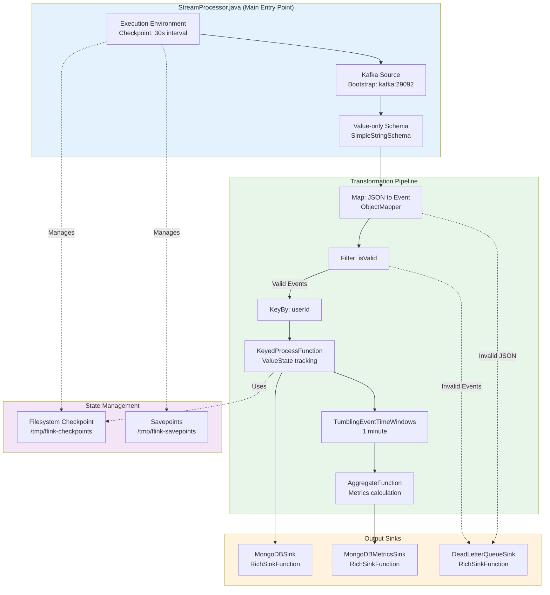
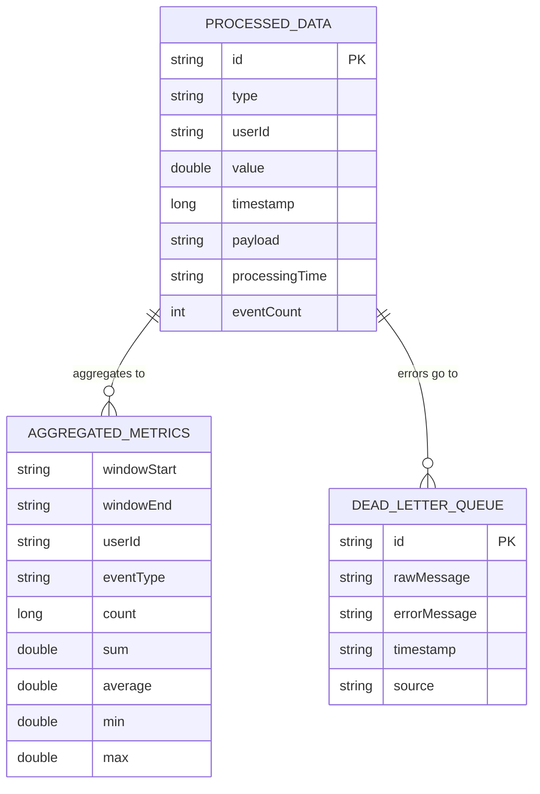
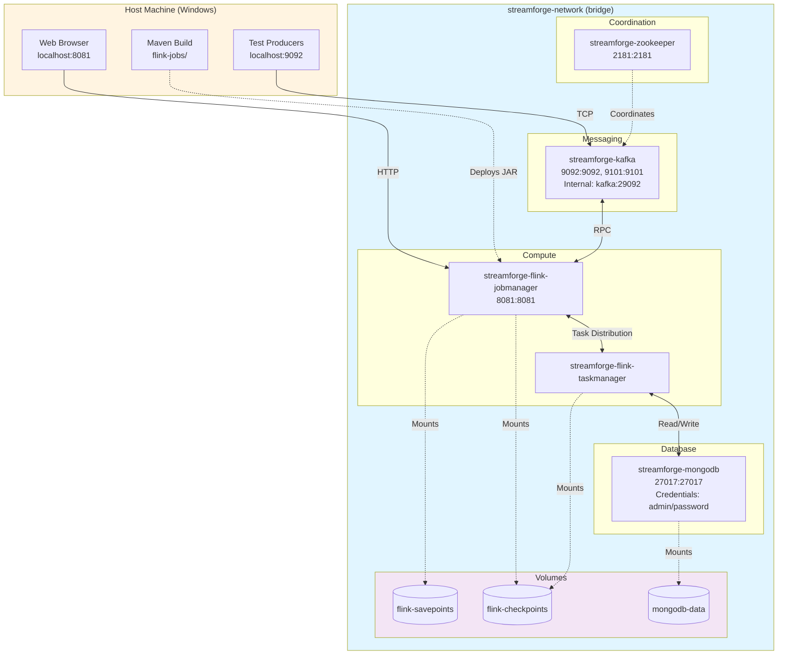
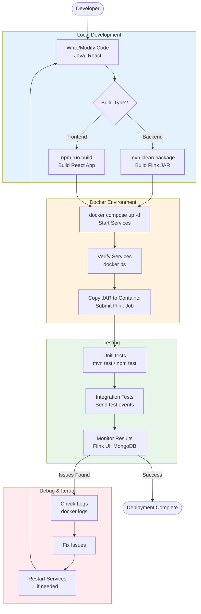
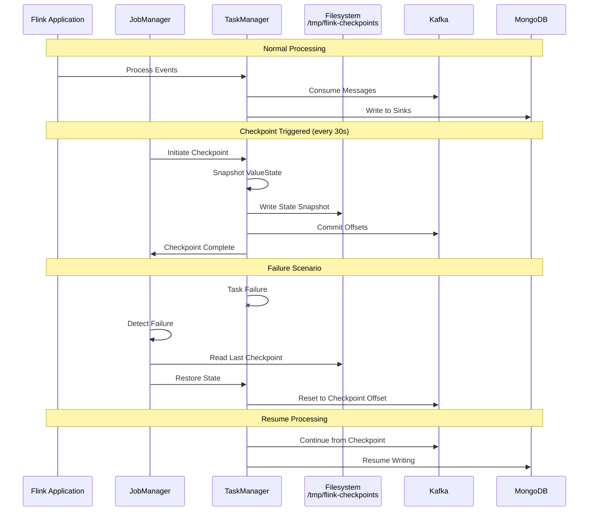
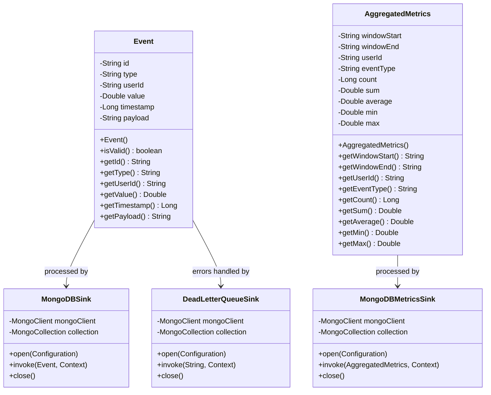
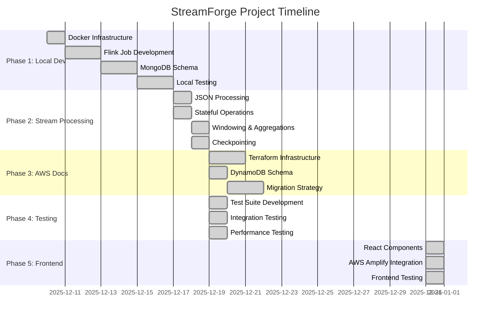

# StreamForge Process Flow

This document contains Mermaid diagrams visualizing the StreamForge real-time streaming platform architecture.

## High-Level Architecture

## Detailed Data Flow Pipeline

## Event Processing Lifecycle

## Flink Job Architecture

## MongoDB Collections Schema

## Docker Container Network

## Development Workflow

## Checkpoint and Fault Tolerance

## Event Data Model

## Deployment Timeline (Gantt Chart)

---

## How to Use These Diagrams

### Viewing in VS Code
Install the "Markdown Preview Mermaid Support" extension to render these diagrams.

### Viewing in GitHub
GitHub natively supports Mermaid diagrams in markdown files.

### Exporting
Use tools like [Mermaid Live Editor](https://mermaid.live/) to export diagrams as PNG/SVG.

### Updating
Edit the Mermaid code blocks directly in this file to reflect architecture changes.
