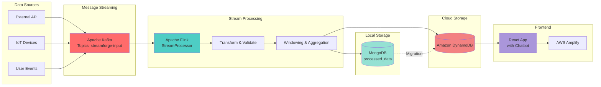
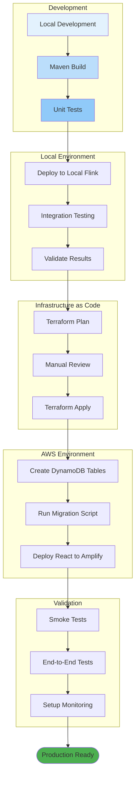
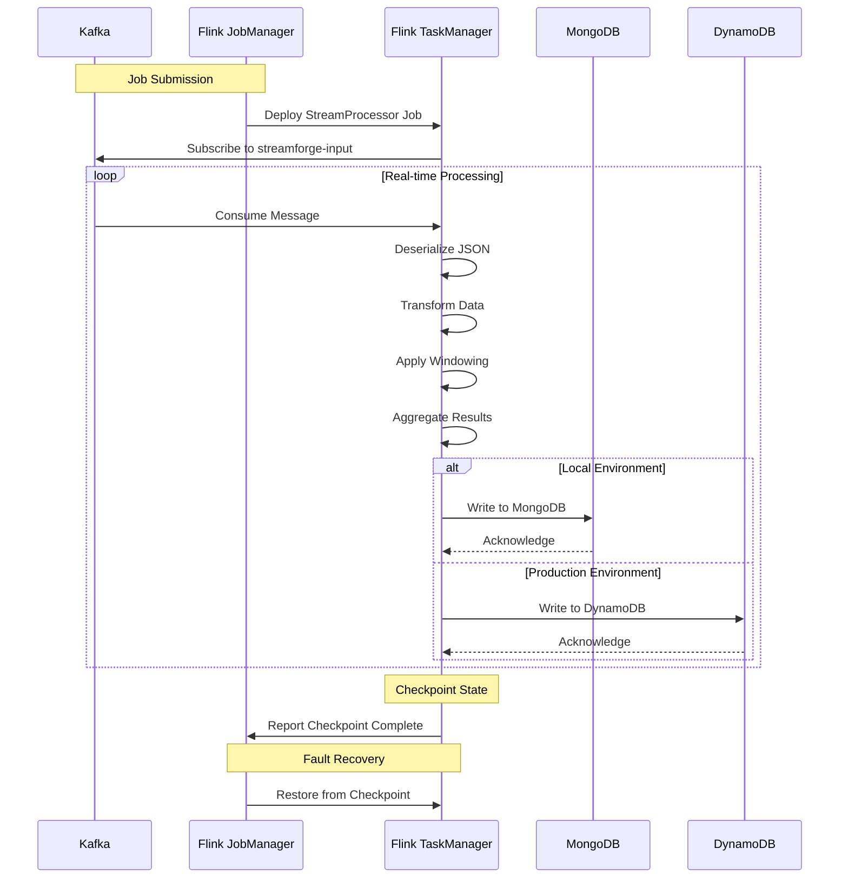
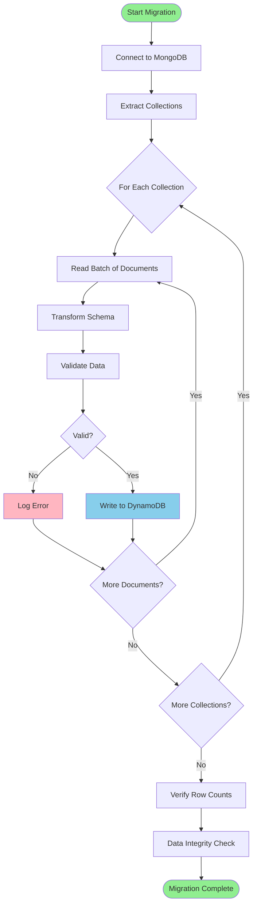
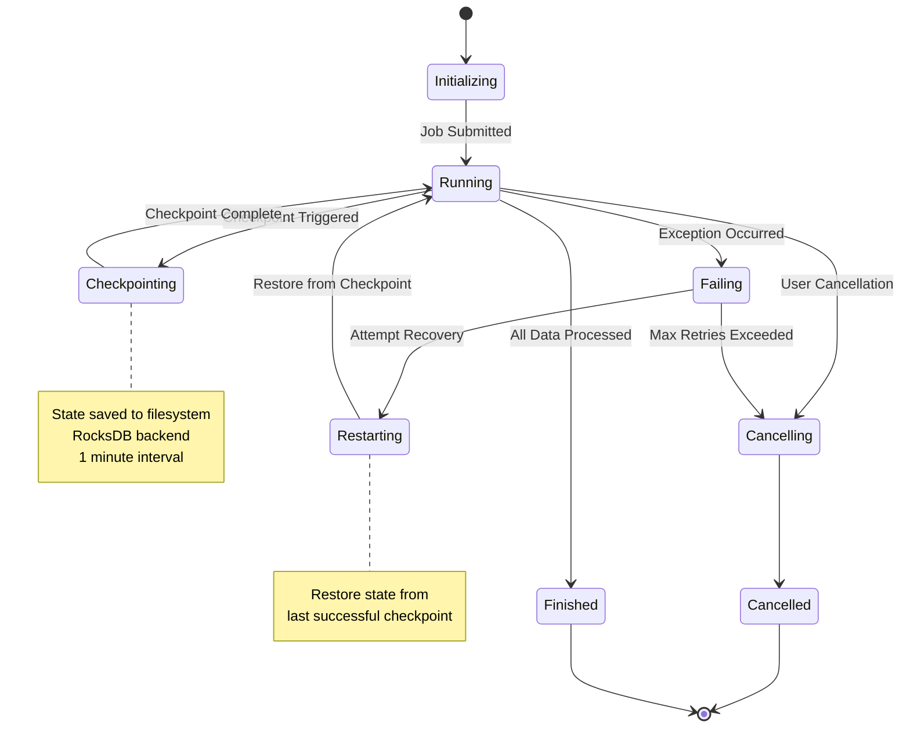
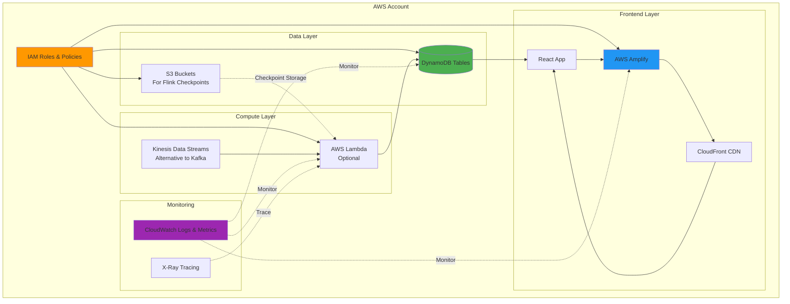
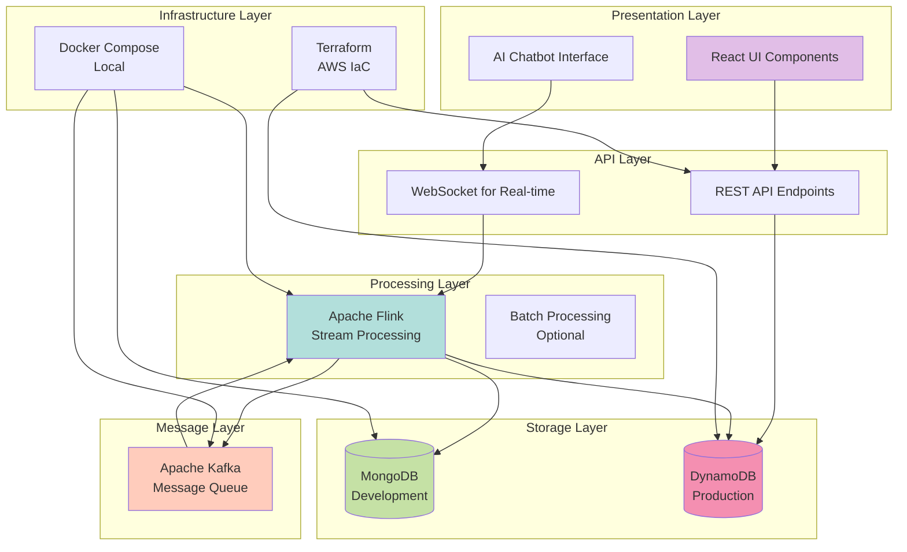

# StreamForge Project Workflow

This document contains Mermaid diagrams illustrating the StreamForge project workflow, architecture, and deployment process.

## Project Development Workflow

```mermaid
    graph TB
        Start([Project Start]) --> Phase1[Phase 1: Local Development]
        
        Phase1 --> Docker[Docker Infrastructure Setup]
        Docker --> Kafka[Kafka & Zookeeper]
        Docker --> Flink[Flink JobManager & TaskManager]
        Docker --> MongoDB[MongoDB Database]
        
        Kafka --> FlinkJob[Flink Job Development]
        Flink --> FlinkJob
        FlinkJob --> StreamProcessor[StreamProcessor.java]
        FlinkJob --> MongoSink[MongoDBSink.java]
        
        StreamProcessor --> KafkaTopics[Configure Kafka Topics]
        MongoSink --> MongoSchema[Design MongoDB Schema]
        
        KafkaTopics --> LocalTest[Local Testing]
        MongoSchema --> LocalTest
        
        LocalTest --> Phase1Complete{Phase 1 Complete?}
        Phase1Complete -->|No| FlinkJob
        Phase1Complete -->|Yes| Phase2[Phase 2: Stream Processing]
        
        Phase2 --> JSON[JSON Deserialization]
        JSON --> Validation[Data Validation]
        Validation --> Stateful[Stateful Processing]
        Stateful --> Windowing[Windowing Operations]
        Windowing --> Aggregations[Aggregations]
        Aggregations --> Checkpointing[Checkpointing Config]
        Checkpointing --> ErrorHandling[Error Handling]
        ErrorHandling --> PerfTest[Performance Testing]
        
        PerfTest --> Phase2Complete{Phase 2 Complete?}
        Phase2Complete -->|No| JSON
        Phase2Complete -->|Yes| Phase3[Phase 3: AWS Deployment]
        
        Phase3 --> Terraform[Create Terraform Modules]
        Terraform --> DynamoDB[Configure DynamoDB]
        DynamoDB --> DeployDB[Deploy DynamoDB]
        
        Phase3 --> Migration[MongoDB to DynamoDB Migration]
        Migration --> MigrationTest[Test Migration]
        
        DeployDB --> Frontend[Build React Frontend]
        Frontend --> Chatbot[Chatbot UI Components]
        Chatbot --> Amplify[Configure AWS Amplify]
        Amplify --> Deploy[Deploy to Amplify]
        
        MigrationTest --> Validation2[Validate Data Integrity]
        Deploy --> FinalTest[End-to-End Testing]
        Validation2 --> FinalTest
        
        FinalTest --> Complete([Project Complete])
        
        style Start fill:#90EE90
        style Complete fill:#90EE90
        style Phase1 fill:#87CEEB
        style Phase2 fill:#87CEEB
        style Phase3 fill:#87CEEB
        style LocalTest fill:#FFD700
        style PerfTest fill:#FFD700
        style FinalTest fill:#FFD700
```

## Data Flow Architecture

## Deployment Pipeline

## Flink Job Execution Flow

## MongoDB to DynamoDB Migration Flow

## State Management & Checkpointing

## AWS Infrastructure Dependencies

## Technology Stack Layers

---

## How to View These Diagrams

These Mermaid diagrams can be viewed in:

1. **GitHub/GitLab**: Automatically rendered in markdown files
2. **VS Code**: Install the "Markdown Preview Mermaid Support" extension
3. **Online**: [Mermaid Live Editor](https://mermaid.live)
4. **Documentation Sites**: GitBook, Docusaurus, MkDocs with Mermaid plugin

## Diagram Descriptions

- **Project Development Workflow**: Shows the complete development process from Phase 1 to Phase 3
- **Data Flow Architecture**: Illustrates how data moves through the system
- **Deployment Pipeline**: Details the CI/CD process from development to production
- **Flink Job Execution Flow**: Sequence diagram showing message processing
- **MongoDB to DynamoDB Migration**: Step-by-step migration process
- **State Management & Checkpointing**: Flink job state transitions
- **AWS Infrastructure Dependencies**: Cloud resources and their relationships
- **Technology Stack Layers**: System architecture by layer
